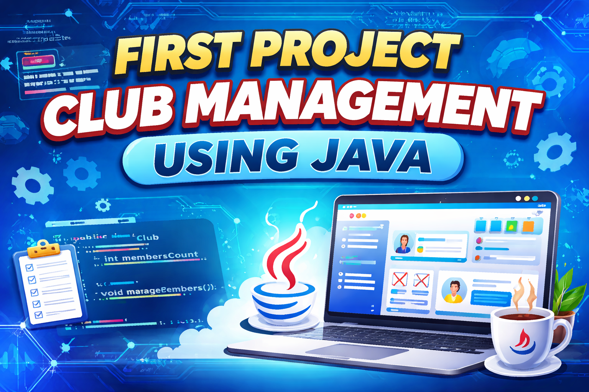

# Club Management System

## 📌 Description
The **Club Management System** is a Java desktop application developed using **Java Swing** and **MySQL**.  
It allows students to register, log in, manage their profiles, and participate in club activities.

This project demonstrates:
- GUI development with Java Swing
- Database connectivity using JDBC
- CRUD operations with MySQL
- Basic project structuring

---

## 🗂️ Project Structure

> All Java files are in the root folder for simplicity.  
> `src/img/` contains background images, and `src/db/` contains the database SQL file.  
> `lib/` contains the MySQL JDBC driver (`mysql-connector-j.jar`).

---

## 🛠️ Technologies Used
- Java SE
- Java Swing
- MySQL / MariaDB
- JDBC (MySQL Connector)
- XAMPP / phpMyAdmin

---

## 🚀 Application Features
- User registration (Sign Up)
- User authentication (Login)
- Profile visualization
- Club selection
- Activity creation
- Activity calendar display
- MySQL database integration

---

## 🔄 Application Workflow
1. **Welcome Interface**  
   - Choose between Sign Up or Login

2. **Registration**  
   - Enter personal information  
   - Select a club  
   - Save data to database

3. **Login**  
   - Authenticate using email and password

4. **User Menu**  
   - View profile  
   - Add an activity

5. **Activities**  
   - Add new activities  
   - View all activities in a calendar

---

## 📂 Java Classes Explanation

### `Welcome.java`
- Main entry point of the application  
- Allows user to choose between Login and Registration

### `ConnexionBD.java`
- Handles database connection using JDBC  
- Centralized MySQL connection class

### `login.java`
- Login interface  
- Checks user credentials from database

### `Inscription.java`
- User registration form  
- Inserts new users into database

### `choix.java`
- User dashboard  
- Allows navigation to profile or activity creation

### `VoirUser.java`
- Displays user profile information  
- Shows related club and activities

### `AjouterActivity.java`
- Allows users to add new activities  
- Links activity to user and club

### `CalendrierActivity.java`
- Displays all activities in a table  
- Acts as an activity calendar

---

## 🗄️ Database Information

**Database Name:** `club`

### Tables

#### `users`
| Column      | Type          | Key     |
|------------|---------------|---------|
| id_user    | int(11)       | PK      |
| nom        | varchar(200)  |         |
| prenom     | varchar(200)  |         |
| email      | varchar(300)  | UNIQUE  |
| password   | varchar(20)   |         |
| role       | varchar(100)  |         |
| id_club    | int(11)       | FK      |

#### `club`
| Column      | Type          | Key |
|------------|---------------|-----|
| id_club    | int(11)       | PK  |
| nom_club   | varchar(200)  |     |

#### `activitee`
| Column         | Type          | Key |
|---------------|---------------|-----|
| id_activitee  | int(11)       | PK  |
| nom_activitee | varchar(200)  |     |
| type          | varchar(100)  |     |
| date_activitee| date          |     |
| id_club       | int(11)       | FK  |
| id_user       | int(11)       | FK  |

---

## 🎥 Execution Video

1. Open the project in **NetBeans / IntelliJ / Eclipse**  
2. Add `mysql-connector-j.jar` from `lib/` to the project libraries  
3. Run `Welcome.java`  

> Insert your execution video here once recorded.

---

## 🔐 Default Database Configuration
- **Host:** localhost  
- **Port:** 3306  
- **Database:** club  
- **Username:** root  
- **Password:** (default empty for XAMPP)  

---

## 📌 Notes
- Background images must be located in `src/img`  
- MySQL Connector must be correctly linked  
- This project uses plain text passwords (for learning purposes only)

---

## 👨‍💻 Author
Developed as an **academic Java Swing & MySQL project**.

---

## 📄 License
This project is intended for **educational use only**.
